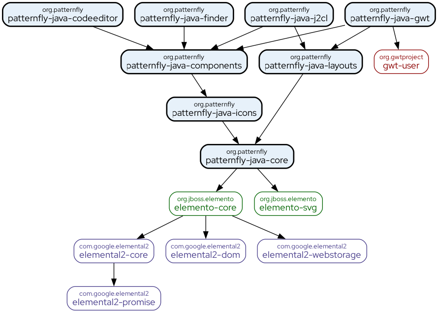

# Changelog

All notable changes to this project will be documented in this file.

The format is based on [Keep a Changelog](https://keepachangelog.com/en/1.0.0/), and this project adheres to [Semantic Versioning](https://semver.org/spec/v2.0.0.html).

## [Unreleased]

### Added

- Add `Tbody.clearEmpty()`
- Add `TreeViewItem.reload()`
- Add `TreeViewItem.parent()`
- Add `HasItems.contains(String identifier)`
- `HasItems` → `WithIdentifier` and `ComponentContext` is now implemented by `Form` → `FormGroup`
- Add `TextArea.placeholder(String placeholder)`
- Add `AlertGroup.toastAlertGroup()` factory method
- Add `FormSelect.selectFirstValue()` and `FormSelect.containsValue()`
- Add `TextArea.onKeyup()` and `TextInput.onKeyup()`

### Changed

- Change internal event handler for `TextArea.onChange()` and `TextInput.onChange()` from `keyup` to `change`
- Rename `InputGroupItem.addFormControl(FormControl control)` to `InputGroupItem.addControl(FormControl control)`
- Replace `FormGroup.fieldId(String id)` with `FormGroup.formGroup(String identifier)`
- Replace yarn with npm

### Fixed

- Fix `Panel.addMain(PanelMain)`

## [0.2.10] - 2024-09-22

### Added

- MultiSelect component (part of #68)
- Table component: Tree table (part of #90)
- Toolbar component (part of #98)
- Add `Filter<T>`, `FilterAttribute<T, V>`, and `FilterCondition<T, V>` to filter arbitrary data
- Add `MenuToggleMenu.stayOpen()`
- Add `Tabs.initialSelection(String)`

### Upgrades

- Bump Elemento to 1.6.10

## [0.2.9] - 2024-08-21

### Added

- Add `HasItems.items()`
- Add `Variable.utilVar(String, String...)`
- Add `TextInputGroup.clear()`
- Add `TextInputGroup.onChange(ChangeHandler<TextInputGroup, String> changeHandler)`
- Add `TreeViewItem.disabled(boolean)`

### Changed

- Support multiple event handlers in (sub)components
- Make `TreeViewItem.load()` and `TreeViewItem.status()` public

### Upgrades

- Bump Elemento to 1.6.8

## [0.2.8] - 2024-07-30

### Added

- Add `Switch.readonly()`
- Add `Label.disabled()`
- Add `TreeView.select(String id)`
- Add `HasItems` → `WithIdentifier` and `ComponentContext` interfaces (if missing). Implemented by
  - `Accordion` → `AccordionItem`
  - `ActionList`, `ActionListGroup` → `ActionListItem`
  - `AlterGroup` → `Alert`
  - `Breadcrumb` → `BreadcrumbItem`
  - `ChipGroup` → `Chip`
  - `DataList` → `DataListItem`
  - `DescriptionList` → `DescriptionListGroup`
  - `JumpLinks`, `JumpLinksList` → `JumpLinksItem`
  - `LabelGroup` → `Label`
  - `List` → `ListItem`
  - `MenuList` → `MenuItem`
  - `Navigation`, `NavigationGroup`, `ExpandableNavigationGroup` → `NavigationItem`
  - `SimpleList`, `SimpleListGroup` → `SimpleListItem`
  - `Tabs` → `Tab`
  - `TBody` → `Tr`
  - `ToggleGroup` → `ToggleGroupItem`
  - `ToolbarContent`, `ToolbarGroup` → `ToolbarItem`
  - `Tr` → `Cell` (`Th` | `Td`)
  - `TreeView`, `TreeViewItem` → `TreeViewItem`

### Changed

- Add warning when the DOM of a tree view item cannot be finished

### Removed

- Remove `HasValues<Chip>` from `ChipGroup`. This is replaced now by `HasItems`.

### Fixed

- Expand tree view item after `TreeView.select(TreeViewItem item)`

### Upgrades

- Bump Elemento to 1.6.6

## [0.2.7] - 2024-07-18

### Added

- Data list component (#34) (not yet fully implemented)
- Tree view component (#100) (not yet fully implemented)
- Add `ComponentContext` interface to store and retrieve arbitrary values associated with keys in a component. Implemented by
  - `AccordionItem`
  - `ActionListItem`
  - `BreadcrumbItem`
  - `DataListItem`
  - `JumpLinksItem`
  - `ListItem`
  - `MenuItem`
  - `NavigationItem`
  - `SimpleListItem`
  - `TabContent`
  - `Td`, `Th`, `Tr`
  - `ToggleGroupItem`
  - `ToolbarItem`
  - `TreeViewItem`
- Add `FlexWrap.noWrap` modifier
- Add methods to swap typed modifiers:
  - `static <T extends TypedModifier, E extends Element, B extends TypedBuilder<E, B>> B TypedModifier.swap(B builder, E element,
    T value, T[] values)`: Swaps a typed modifier on an element builder. Swapping is done by removing all modifiers given as `values` and then setting the new modifier given as `value`.
  - `static <T extends TypedModifier, E extends Element, B extends TypedBuilder<E, B>> B TypedModifier.swap(B builder, E element,
    T current, T previous, Runnable assignment)`: Swaps a typed modifier on an element builder. Swapping is done by removing the previous modifier, applying the current modifier, and optionally performing an assignment.

### Changed

- Unified `select()` method signatures on various components

### Fixed

- Swapping of typed modifiers

### Upgrades

- Bump Elemento to 1.6.5
- Bump J2CL tools BOM to 0.2
- Bump J2CL Maven plugin to 0.23.1
- Bump JUnit to 5.10.3

## [0.2.6] - 2024-06-09

### Added

- Add shortcut methods for default breakpoints
- Add `Variable.asVar()` to wrap the variable name inside `var()`
- Add `List.addItems(Iterable<T> items, Function<T, ListItem> display)` to add multiple list items

### Fixed

- Added the missing password type to the type mapping for `TextInput` (thanks @kolka213)

### Upgrades

- Bump Elemento to 1.6.2

## [0.2.5] - 2024-05-21

### Added

- Backdrop component (#22)
- Modal component (#69)
- Table component (#90) (not yet fully implemented)

### Changed

- Automatic reload after changes to Java sources in J2CL dev mode

### Fixed

- Fix missing JS file for PatternFly Java J2CL

### Removed

- Mockito dependency

## [0.2.4] - 2024-04-26

### Added

- Add `String WithText.text()` to get the text of the implementing component

### Changed

- Integrate [Elemento logger](https://github.com/hal/elemento?tab=readme-ov-file#logger)

### Fixed

- Builder inheritance of `PredefinedIcon` class

## [0.2.3]

Release skipped.

## [0.2.2] - 2024-04-10

### Added

- Automatic resource injection of [`@popperjs/core`](https://www.npmjs.com/package/@popperjs/core) for PatternFly Java GWT

### Changed

- Update documentation

## [0.2.1] - 2024-04-08

### Added

- Add GWT support and GWT showcase (#146)

## [0.2.0] - 2024-03-27

### Added

Split PatternFly Java into multiple modules:

### Changed

- Add showcase to the PatternFly Java codebase.

### Upgrades

- Bump Elemento to 1.3.3

## [0.1.5] - 2024-03-02

### Added

- Breadcrumb component (#27)
- Jump links component (#60)
- Progress component (#81)
- Simple list component (#84)
- Skeleton component (#85)
- Toggle group component (#97)
- Truncate component (#101)
- Add insert after/before methods for navigation (groups)

### Fixed

- Fix selection in navigation component
- Implement scrolling in horizontal navigation

## [0.1.4] - 2024-01-25

### Fixed

- Add missing externs for the Popper component

## [0.1.3] - 2024-01-25

### Added

#### Components

- Accordion component (#17)
- Back to top component (#21)
- Banner component (#25)
- Description list component (#39)
- Drawer component (#42)
- Empty state component (#44)
- Hint component (#56)
- Input group component (#59)
- List component (#62)
- Panel component (#77) - thanks @halkosajtarevic
- Slider component (#87)
- Switch component (#89)
- Tabs components (#91)

#### Layouts

- Bullseye layout (#118)
- Flex layout (#119)
- Flex layout (#122)
- Split layout (#123)

#### API

- [`Breakpoint`](https://patternfly-java.github.io/patternfly-java/org/patternfly/style/Breakpoint.html) and [`Breakpoints`](https://patternfly-java.github.io/patternfly-java/org/patternfly/style/Breakpoints.html) classes to manage responsive CSS modifiers.

### Fixed

- Min width for dropdown menus

## [0.1.2] - 2023-12-17

### Added

- Helper text component (#55)
- Form component (#49)
- Form control component (#50)
- Form select component (#51)
- Text area component (#53)
- Add support for responsive layout in various components
- Add the following interfaces to unify icon and text handling across components:
  - `WithIcon<E extends Element, B extends TypedBuilder<E, B>>`
  - `WithText<E extends Element, B extends TypedBuilder<E, B>>`
  - `WithIconAndText<E extends Element, B extends TypedBuilder<E, B>>`

### Changed

- Update `Grid` and `GridItem` to support responsive layout
- Replace `ComponentReference<C>` with `ComponentStore`
- Rename `Sidebar` to `PageSidebar` and turn it into a subcomponent of `Page`
- Move `Masthead` component to package `org.patternfly.component.page`
- Move style related classes to its own package `org.patternfly.style`

### Upgrades

- Bump Elemento to 1.2.11

## [0.1.1] - 2023-11-22

### Added

- Card component (#29)
- Label component (#61)
- Radio component (#53)
- Gallery layout (#120)
- Grid layout (#121)
- Classify and group log messages

### Changed

- Checkbox component: replace implicit standalone modifier with explicit method

### Removed

- Remove deprecated classes

## [0.1.0] - 2023-11-15

### Added

- Add J2CL support
- Avatar component (#20)
- Menu toggle component (#67)
- Dropdown component (#65)
- Add `ThirdParty.injectXXX()` methods to inject 3rd party dependencies

### Fixed

- Fix selection handler for checkbox menu items

## [0.0.7] - 2023-10-30

### Added

- Popover component (#80)

### Changed

- Refactor [popper.txt](https://popper.txt.org/) integration

## [0.0.6] - 2023-10-25

### Added

- Tooltip component (#99)

## [0.0.5] - 2023-10-18

### Added

- Action list component (#18)
- Alert component (#19)
- Brand component (#26)
- Chip component (#30)
- Code editor (#33) (half done - w/o [Monaco editor](https://microsoft.github.io/monaco-editor/) integration)
- Sidebar component (#83)
- Text input group component (#93)
- Add `Closeable` interface and `CloseHandler`
- Add `Expandable` interface
- Add `Variable` and `VariableScope`

### Changed

- Move masthead, sidebar, and skip to content components to its own packages
- Refactor `org.patternfly.component.WithProgress` interface
- Simplify `org.patternfly.style.Modifiers.*` interfaces
- Rename `org.patternfly.js` → `org.patternfly.dom`

## [0.0.4] - 2023-10-10

### Changed

- Refactor alert component factory methods

## [0.0.3] - 2023-10-10

### Added

- Code editor component (#33)

### Upgrades

- Bump Elemento to 1.2.2

## [0.0.2] - 2023-10-10

### Added

- Badge component (#24)
- Button component (#28)
- Checkbox component (#48)
- Code block component (#32)
- Divider component (#40)
- Expandable section component (#45)
- Icon component (#57)
- Masthead component (#64)
- Menu component (#66)
- Navigation component (#70)
- Page component (#75)
- Text input component (#54)
- Skip to content component (#86)
- Spinner component (#88)
- Text content component (#92)
- Title component (#96)
- Stack layout (#124)

### Deprecated

- Marked old (PatternFly 4) components as deprecated

## [0.0.1] - 2023-10-05

This is the first public release of PatternFly Java 🍾🎉🎊🥳

Stay tuned for more to come...

<!--
## Template

### Added

- for new features

### Changed

- for changes in existing functionality

### Fixed

- for any bug fixes

### Security

- in case of vulnerabilities

### Deprecated

- for soon-to-be removed features

### Removed

- for now removed features

### Upgrades

- for dependency upgrades
-->

[Unreleased]: https://github.com/patternfly-java/patternfly-java/compare/v0.2.10...HEAD
[0.2.10]: https://github.com/patternfly-java/patternfly-java/compare/v0.2.9...v0.2.10
[0.2.9]: https://github.com/patternfly-java/patternfly-java/compare/v0.2.8...v0.2.9
[0.2.8]: https://github.com/patternfly-java/patternfly-java/compare/v0.2.7...v0.2.8
[0.2.7]: https://github.com/patternfly-java/patternfly-java/compare/v0.2.6...v0.2.7
[0.2.6]: https://github.com/patternfly-java/patternfly-java/compare/v0.2.5...v0.2.6
[0.2.5]: https://github.com/patternfly-java/patternfly-java/compare/v0.2.4...v0.2.5
[0.2.4]: https://github.com/patternfly-java/patternfly-java/compare/v0.2.3...v0.2.4
[0.2.3]: https://github.com/patternfly-java/patternfly-java/compare/v0.2.2...v0.2.3
[0.2.2]: https://github.com/patternfly-java/patternfly-java/compare/v0.2.1...v0.2.2
[0.2.1]: https://github.com/patternfly-java/patternfly-java/compare/v0.2.0...v0.2.1
[0.2.0]: https://github.com/patternfly-java/patternfly-java/compare/v0.1.5...v0.2.0
[0.1.5]: https://github.com/patternfly-java/patternfly-java/compare/v0.1.4...v0.1.5
[0.1.4]: https://github.com/patternfly-java/patternfly-java/compare/v0.1.3...v0.1.4
[0.1.3]: https://github.com/patternfly-java/patternfly-java/compare/v0.1.2...v0.1.3
[0.1.2]: https://github.com/patternfly-java/patternfly-java/compare/v0.1.1...v0.1.2
[0.1.1]: https://github.com/patternfly-java/patternfly-java/compare/v0.1.0...v0.1.1
[0.1.0]: https://github.com/patternfly-java/patternfly-java/compare/v0.0.7...v0.1.0
[0.0.7]: https://github.com/patternfly-java/patternfly-java/compare/v0.0.6...v0.0.7
[0.0.6]: https://github.com/patternfly-java/patternfly-java/compare/v0.0.5...v0.0.6
[0.0.5]: https://github.com/patternfly-java/patternfly-java/compare/v0.0.4...v0.0.5
[0.0.4]: https://github.com/patternfly-java/patternfly-java/compare/v0.0.3...v0.0.4
[0.0.3]: https://github.com/patternfly-java/patternfly-java/compare/v0.0.2...v0.0.3
[0.0.2]: https://github.com/patternfly-java/patternfly-java/compare/v0.0.1...v0.0.2
[0.0.1]: https://github.com/patternfly-java/patternfly-java/compare/vTemplate...v0.0.1
