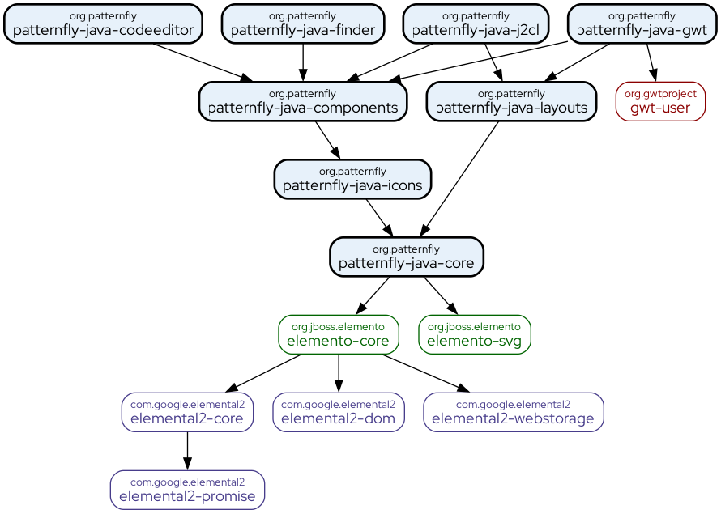

# Changelog

All notable changes to this project will be documented in this file.

The format is based on [Keep a Changelog](https://keepachangelog.com/en/1.0.0/), and this project adheres to [Semantic Versioning](https://semver.org/spec/v2.0.0.html).

## [Unreleased]

### Added

- Add finder path restoration with `Finder.select(String)` and `Finder.select(FinderPath)` for async column loading and programmatic path selection
- Add `Finder.activePath()` method returning the selection path up to the currently active column, useful for URL synchronisation during arrow-left keyboard navigation

### Changed

- Change `Finder.select(FinderPath)` to fire select and preview events only for the deepest resolved item instead of every intermediate segment during path restoration
- Fire `SelectHandler` on ArrowLeft keyboard navigation so consumers are notified when focus moves back to a previously selected item
- Upgrade Elemento from 2.4.11 to 2.5.2

### Fixed

- Improve finder path selection resilience by stopping on missing columns or items instead of continuing with stale state
- Fix code review findings across `org.patternfly.component` package
- Fix markdown directory tree copy in publish-docs workflow

## [0.9.1] - 2026-06-08

### Added

- Add manifest-driven markdown documentation system with nested directory structure, Node-based remark/rehype pipeline with Shiki highlighting, and showcase pages for API design, icons, tokens, building, CI/CD, and releasing
- Add Navigation `docked()` modifier and `ariaLabel()` on NavigationGroup and NavigationItem
- Add showcase demos for button, card, drawer, tabs, banner, panel, progress, breadcrumb, truncate, and navigation
- Add template component package (`org.patternfly.component.template`) as a blueprint for new components
- Add project skills: `/pf-lint`, `/pf-update`, `/pf-status`, `/pf-dev-env`
- Add `CardSubtitle` sub-component with `addSubtitle()` on `CardTitle`
- Add `Secondary` modifier interface to Card
- Add animated button variants: `hamburger()`, `favorite()`/`favorited()`, and `settings()` with SVG-based animations
- Add `clicked()`, `ariaExpanded()`, `ariaDisabled()`, and `ariaLabel()` methods to Button
- Add build-time validation for inline JavaDoc code snippets via `snippet-tests` module
- Add `secondary()`, `pill()`, and `scrollableAutoHeight()` methods to Panel

### Changed

- Migrate showcase from Java-generated pages to manifest-driven Node markdown pipeline with YAML frontmatter, Shiki highlighting, and `_meta.yaml` navigation groups, replacing `doc.java`, boilerplate page classes, highlight.js, and link-list index pages
- Refactor navigation internals: wrap expandable group text in `span.pf-v6-c-nav__link-text`, switch to `ElementTextDelegate`, lazy text element creation
- Move formatting, linting, and enforcer plugins to opt-in Maven profiles (`format`, `check`)
- Import PatternFly.org styles from npm package instead of stale local copies
- Replace JBang code generation with Node scripts (`version.mjs`, `code.mjs`) using maven-frontend-plugin
- Slim down README from 385 to ~40 lines, linking to showcase for detailed documentation
- Upgrade pnpm from 11.3.0 to 11.5.2
- Upgrade Jackson from 2.x to 3.x in test dependencies

### Fixed

- Fix `Button.iconAndText()` dropping `pf-m-start`/`pf-m-end` icon position modifiers due to `removeIcon()` cycle
- Fix `PageSidebar` missing `sidebar-main` wrapper for glass contrast mode
- Fix accordion alignment: correct toggle icon, wrap button in `<dt>`/`<h>`, add `pf-m-toggle-start`, `pf-m-bordered`, and `role="region"`
- Fix navigation alignment: correct expandable group icon, add `inert` on collapsed subnav, add `id`/`aria-labelledby` to sections, remove extra dividers
- Fix icon usage across components: switch button close/copy and scroll button icons to correct rhMicrons/rhUi sets
- Fix component conventions: add missing Javadoc on ~110 sub-components, fix duplicate `SUB_COMPONENT_ID` values and `FormSelectOption` constructor visibility
- Fix `-Dquickly` not skipping J2CL compilation when combined with `-P showcase`
- Fix charts/npm lockfile out of sync with package.json
- Fix stale markdown version bump path in `versionBump.sh`
- Add `aria-label` attributes to icon-only buttons across showcase demos
- Add Closure Compiler externs for markdown JsInterop types

## [0.9.0] - 2026-05-28

### Added

- Add `/pf-align` skill for implementing missing variations and fixing DOM/CSS differences identified by `/pf-compare`
- Add `/pf-compare` skill for comparing PatternFly components against their PatternFly Java implementations using Chrome DevTools MCP browser automation
- Add Red Hat brand icon sets (rhUi, rhMicrons, rhStandard) with 1,136 new icons alongside existing FontAwesome icons
- Add `rhIcons.mjs` adapter script for RH icon generation with multi-path SVG flattening
- Add dynamic lookup support for `rhUi`, `rhMicrons`, and `rhStandard` prefixes in `PredefinedIcon.predefinedIcon(String)`
- Add Project Felt theme support with `Theme` enum and `ThemeManager<Theme>`
- Add Glass contrast mode with `Contrast.GLASS` mapping to `pf-v6-theme-glass`
- Add `Glass` and `NoPlainOnGlass` modifier interfaces to `Modifiers`
- Add `glass` and `noPlainOnGlass` CSS constants to `Classes`
- Add `Circle` and `Pill` modifier interfaces to `Modifiers` with `circle` and `pill` CSS constants
- Add `Circle` modifier to Button
- Add `Vertical` modifier to ActionList
- Add `Plain` modifier to Table, DataList, DrawerSection, Wizard
- Add `NoPlainOnGlass` modifier to DataList
- Add `Pill` modifier to Drawer, Banner
- Add `Glass` and `NoPlainOnGlass` modifiers to DrawerPanel
- Add `Plain` and `NoPlainOnGlass` modifiers to Accordion
- Add `FullWidth` modifier to ToggleGroup
- Add `Glass` modifier to Card
- Add `Plain` modifier to NotificationBadge
- Add `ariaDescribedBy(String)` to Radio and Checkbox
- Add `hideStatusIcon()` to Progress
- Add `ariaLabel(String)` to ExpandableSection
- Add `Glass` modifier to PageSection for sticky glass sections
- Add `add()` variant to Label for `.pf-m-add` modifier
- Add `form()` styling to MenuToggle for form context usage
- Add `nav()` variant to Tabs for navigation-style tabs
- Add `tabListAriaLabel(String)` to Tabs for inner tab list accessibility
- Add `moreText(String)`, `lessText(String)`, `hideIcon()`, `showIcon()`, and `icon(Element)` to ExpandableSectionToggle
- Add `stickyHeader()` to Table with `stickyHeader` CSS constant
- Add `heights(String)` and `heights(Breakpoints<String>)` to Toolbar for responsive height support

### Changed

- Migrate showcase and charts build tooling from Parcel to Vite, removing LightningCSS workarounds for `@container anchored()` rules and relative `url()` in CSS custom properties
- Standardize pnpm 11.3.0 as the package manager across all npm packages, replacing a dev pre-release version in charts, core, and finder
- Split `IconSpecs` into separate top-level enum classes per icon set with automatic chunking (configurable via `node generate.mjs <chunkSize>`) to fix J2CL static initializer exceeding the 64KB bytecode limit
- Improve `/pf-compare` and `/pf-align` skills with progressive disclosure, extracted JS scripts and templates to references/, added example reports, enriched trigger phrases, and standardized tool naming
- Replace FontAwesome icons with Red Hat brand icons across all components (close, carets, status icons, utility icons)
- Migrate showcase icon references from FontAwesome 5 to Red Hat brand icon sets (rhUi)
- Update `Severity` and `ValidationStatus` enums to use rhUi status icons
- Update `@patternfly/react-icons` from 6.2.2 to 6.5.1 and `@patternfly/patternfly` from 6.2.3 to 6.5.2
- Update `@patternfly/react-tokens` from 6.2.2 to 6.5.1 adding 58 new design tokens (1,014 → 1,072)
- Update PatternFly CSS version from 6.4.0 to 6.5.2 in pom.xml
- Upgrade FontAwesome icons from 5.x to 7.2.0, adding 533 new icons (2,888 → 3,421 total)
- Update showcase dev dependencies (basic-ftp, puppeteer, wait-on, pnpm)
- Refactor `ThemeManager` to support multi-class value mapping via `Function<E, String>`
- Rebuild `ThemeSelector` with three toggle groups (Theme, Color scheme, Contrast mode) matching PatternFly website
- Expand `Contrast` enum from 3 values (System/On/Off) to 4 values (System/Default/High contrast/Glass)
- Graduate high contrast mode from beta to full release

### Fixed

- Fix Progress danger status icon using wrong icon (`closeCircle` → `errorFill`)
- Fix Drawer panel missing `inert` attribute when collapsed for accessibility
- Fix Form required asterisk orphaning by keeping asterisk inside label text span
- Fix Vite production build warnings by loading J2CL script dynamically and raising chunk size limit

## [0.8.3] - 2026-05-20

### Fixed

- Fix `Tuples.tuples()` calls in showcase components to use explicit `tuple()` pairs

## [0.8.2] - 2026-05-20

### Fixed

- Fix release workflow

## [0.8.1] - 2026-05-20

### Changed

- Use OIDC to publish NPM packages in release workflow

## [0.8.0] - 2026-05-20

### Added

- Add `OuiaSupport` interface in `core` module for custom components to participate in OUIA without extending PatternFly Java base classes; `BaseComponent`, `SubComponent`, `ComponentDelegate`, `BaseLayout`, and `BaseChart` now implement this interface
- Replace direct `Ouia` static method calls with `OuiaSupport` default methods in `Button`, `Icon`, `Skeleton`, `Drawer`, `PageSidebar`, and `ExpandableSection`
- Add Javadoc to all public methods in `Ouia`

## [0.7.8] - 2026-05-19

### Added

- Add OUIA support to all sub-components: every sub-component now renders `data-ouia-component-type` (e.g., `PF6/Component/Card/CardHeader`) and `data-ouia-safe="true"`, with an `ouiaId(String)` method for setting `data-ouia-component-id`

## [0.7.7] - 2026-05-19

### Changed

- Remove `since` and `forRemoval` attributes from `@Deprecated` annotations on Popper.js-based classes and components for J2CL compatibility (deprecation info remains in Javadoc `@deprecated` tags)

## [0.7.6] - 2026-05-19

### Added

- Add `ouiaSafe(HTMLElement, boolean)`, `ouiaSafe(SVGElement, boolean)`, and `ouiaTransition(HTMLElement)` methods to `Ouia` for dynamic `data-ouia-safe` state tracking

### Changed

- Change `Spinner` and `Skeleton` to always set `data-ouia-safe="false"` (loading/placeholder components are never safe)
- Change `Button` and `Icon` to toggle `data-ouia-safe` based on progress state
- Change `Expandable` static helpers and self-managed expandable components (`Drawer`, `ExpandableSection`, `PageSidebar`) to set `data-ouia-safe="false"` during transitions and restore it via `transitionend` with a 300ms fallback timeout

## [0.7.5] - 2026-05-19

### Added

- Add `ouiaId(String)` method to `BaseComponent`, `BaseComponentSVG`, and `ComponentDelegate` for setting stable, deterministic OUIA component IDs

### Changed

- Add `since` and `forRemoval` attributes to all `@Deprecated` annotations on Popper.js-based classes and components
- Improve null safety, reduce code duplication, and address code review findings in core module

### Fixed

- Fix OUIA attribute names to match the spec (`data-ouia-component-type` and `data-ouia-component-id` instead of `data-ouia-type` and `data-ouia-id`)
- Fix OUIA component ID no longer set to the shared `ComponentType.id` — `data-ouia-component-id` is now only set when explicitly provided via `ouiaId(String)`
- Fix format string bug, variable assignment bug, and null guard in core module

## [0.7.4] - 2026-05-10

### Added

- Add `Menu.load()` method to load async menu items

### Changed

- Change `Menu.reload()` return type from `void` to `Promise<Void>` for async support
- Bump `j2cl-maven-plugin` from 0.23.6 to 0.23.7
- Bump `jackson-databind` from 2.21.2 to 2.21.3
- Bump `jboss-parent` from 52 to 53

### Fixed

- Fix NPM vulnerabilities
- Fix Javadoc format issues
- Fix showcase CI jobs

## [0.7.3] - 2026-04-02

### Removed

- Remove the `@Deprecated` annotation from the `org.patternfly.popper` package (J2CL doesn't like annotations on a package).

## [0.7.2] - 2026-04-02

> [!WARNING]
> Not an official release. Please don't use!

## [0.7.1] - 2026-04-02

### Fixed

- Fix vulnerabilities in the NPM dependencies of the charts module.

## [0.7.0] - 2026-04-02

> [!IMPORTANT]
> This release deprecates components based on PopperJS and adds alternatives using the [popover API](https://developer.mozilla.org/en-US/docs/Web/API/Popover_API) and [CSS anchor positioning](https://developer.mozilla.org/en-US/docs/Web/CSS/Guides/Anchor_positioning). The PopperJS based components have been renamed to `PopperJS<ComponentName>` and reimplemented `<ComponentName>` components are the replacements. This might break existing code!

- `org.patternfly.component.popover.PopperPopover` → `org.patternfly.component.popover.Popover`
- `org.patternfly.component.tooltip.PopperTooltip` → `org.patternfly.component.tooltip.Tooltip`
- `org.patternfly.component.menu.PopperDropdown` → `org.patternfly.component.menu.Dropdown`
- `org.patternfly.component.menu.PopperMultiSelect` → `org.patternfly.component.menu.MultiSelect`
- `org.patternfly.component.menu.PopperMultiTypeahead` → `org.patternfly.component.menu.MultiTypeahead`
- `org.patternfly.component.menu.PopperSingleSelect` → `org.patternfly.component.menu.SingleSelect`
- `org.patternfly.component.menu.PopperSingleTypeahead` → `org.patternfly.component.menu.SingleTypeahead`

If the browser does not support [CSS anchor positioning](https://caniuse.com/css-anchor-positioning) or [anchor-based container queries](https://caniuse.com/wf-container-anchor-position-queries), the placement of the popover is calculated using the new `Overlay` class. The only requirement is that the browser supports the [popover API](https://caniuse.com/wf-popover), which is available now in all major browsers.

### Added

- Add native alternatives for dropdown, single and multi-select, and single and multi-type-ahead components
- Deprecate components based on PopperJS
- Add new `Overlay` class replacing the deprecated `PopperBuilder`

## [0.6.16] - 2026-03-26

### Added

- Add native popover and tooltip components based on the [popover API](https://developer.mozilla.org/en-US/docs/Web/API/Popover_API) and [CSS anchor positioning](https://developer.mozilla.org/en-US/docs/Web/CSS/Guides/Anchor_positioning).

### Fixed

- Fix loading finder items

## [0.6.15] - 2026-03-25

### Added

- Make the finder column and preview responsive using container queries

## [0.6.14] - 2026-03-24

### Added

- Add `FinderColumn.showSearchThreshold(int)`

### Changed

- Add padding to the finder preview matching the padding of the finder columns and items

## [0.6.13] - 2026-03-24

> [!WARNING]
> Not an official release. Please don't use!

## [0.6.12] - 2026-03-24

> [!WARNING]
> Not an official release. Please don't use!

## [0.6.11] - 2026-03-24

> [!WARNING]
> Not an official release. Please don't use!

## [0.6.10] - 2026-03-24

### Added

- Add `FinderColumn.finderColumn(String identifier, String header)`
- Add `FinderColumn.defaultSearch(String)`
- Add `FinderColumn.toggleSearch(Predicate<FinderColumn>)`

### Fixed

- Hide item actions in inactive columns

### Removed

- Remove `FinderItem.nextColumn(FinderColumn column)`. Next columns can only be added lazily using
  `FinderItem.nextColumn(Supplier<FinderColumn> column)` (otherwise the component lookup of finder columns won't work).

## [0.6.9] - 2026-03-23

> [!WARNING]
> Not an official release. Please don't use!

## [0.6.8] - 2026-03-23

### Added

- Add `FinderPath` and `FinderSegment` with `FinderPath` implementing `Iterable<FinderSegment>`
- Add `FinderPath Finder.path()`
- Add getters for the finder and finder column:
    - `FinderColumn FinderItem.column()`
    - `Finder FinderItem.finder()`
    - `Finder FinderColumn.finder()`

### Fixed

- Fix selection of already selected finder items

## [0.6.7] - 2026-03-22

### Added

- Add support for `BiPredicate<FinderItem, String>` in `FinderColumnSearch`

### Fixed

- Fix finder item icons
- Fix colors for finder item actions
- Fix finder preview handlers

## [0.6.6] - 2026-03-20

### Added

- Add support for finder item actions
- Add `Finder.bordered(boolean)`
- Add `Finder.pinnable(boolean)`

## [0.6.5] - 2026-03-20

### Fixed

- Fix showcase externs

## [0.6.4] - 2026-03-20

### Fixed

- Fix NPM publishing

## [0.6.3] - 2026-03-20

### Added

- Add missing J2CL externs for the showcase

### Fixed

- Fix NPM publishing

## [0.6.2] - 2026-03-19

### Added

- Add support for async items to the finder component

### Fixed

- Fix finder column header heights

## [0.6.1] - 2026-03-19

### Added

- Add [finder extension](https://patternfly-java.github.io/extensions/finder) (#371)
- Add
  `HasAsyncItems<E extends Element, C extends HasItems<E, C, S>, S extends HasIdentifier<? extends HTMLElement, ?>>` that defines a common interface for components that can display items asynchronously. These components implement it:
    - `FinderColumn`
    - `MenuList`
    - `TreeViewItem`

### Changed

- Switch to corepack and pnpm

## [0.6.0] - 2026-03-18

> [!WARNING]
> Not an official release. Please don't use!

## [0.5.0] - 2026-02-20

### Added

- Add single and multi-selection handlers to the table component.
- Add `HasItems.updateItem(T item, Function<T,S> display)`, `HasItems.updateItem(S subComponent)`, and
  `HasItems.onUpdate(UpdateItemHandler<C, S> onUpdate)`
- Add `AddItemHandler<C extends HasItems<?, ?, ?>, S extends HasIdentifier<?, ?>>`
- Add `UpdateItemHandler<C extends HasItems<?, ?, ?>, S extends HasIdentifier<?, ?>>`
- Add `RemoveItemHandler<C extends HasItems<?, ?, ?>, S extends HasIdentifier<?, ?>>`
- Add `MenuItem.menuItem(String identifier)` factory method.
- Add `Button.button(PredefinedIcon icon, String href)`
- Add `Button.button(PredefinedIcon icon, String href, String target)`

### Changed

- Change the type parameter `B` representing the builder in `HasItems<E, B ,S>` to `C extends HasItems<E, C, S>`.
- Change the type parameter `S` representing the subcomponent in `HasItems<E, B ,S>` to
  `S extends HasIdentifier<? extends HTMLElement, ?>`.
- Changed `HasItems.onAdd(BiConsumer<B, S>)` to `HasItems.onAdd(AddItemHandler<C, S>)`.
- Changed `HasItems.onRemove(BiConsumer<B, S>)` to `HasItems.onRemove(RemoveItemHandler<C, S>)`.

### Removed

- Remove unsupported constants from `org.patternfly.style.Width`

### Fixed

- Fix `Checkbox.standalone(boolean)`
- Fix `Tbody.empty()`
- Fix NPE when using `Ordered.defaultOrder()`
- Fix `PageMain.clear()` method and `Elements.removeChildrenFrom()` usage in `PageMain`.

### Upgrades

- Bump JBoss Parent to 52
- Bump to Elemento 2.4.9

## [0.4.17] - 2026-02-12

### Added

- Add [`Ordered`](https://patternfly-java.github.io/apidocs/org/patternfly/component/Ordered.html) interface.

## [0.4.16] - 2026-02-05

### Added

- Add `WizardStep.customButtonName(WizardFooterButtons, String)` to define custom button names per step.

## [0.4.15] - 2026-02-05

### Upgrades

- Bump Elemento to 2.4.8

## [0.4.14] - 2026-02-05

> [!WARNING]
> Not an official release. Please don't use!

## [0.4.13] - 2026-02-04

### Changed

- `Wizard` no longer implements `Closeable`
- Add `Wizard.onCancel(ComponentHandler<Wizard> handler)` and `Wizard.onFinish(ComponentHandler<Wizard> handler)`

### Fixed

- Keep selection after call to `MenuList.reload()`
- Fix the disabled state of the wizard footer buttons

## [0.4.12] - 2026-02-03

### Added

- Add pie chart (#113) thanks @mskacelik

### Fixed

- Fix `TreeViewItem.reload()`

### Upgrades

- Bump Elemento to 2.4.7

## [0.4.11] - 2026-01-28

### Changed

- Add an option to create items in single and multi-typeahead components.

## [0.4.10] - 2026-01-20

### Added

- Select component (#68)

### Upgrades

- Bump Elemento to 2.4.6

## [0.4.9] - 2026-01-20

### Added

- Number input component (#73) thanks @mskacelik

### Upgrades

- Bump Elemento to 2.4.4

## [0.4.8] - 2026-01-19

> [!WARNING]
> Not an official release. Please don't use!

## [0.4.7] - 2026-01-19

> [!WARNING]
> Not an official release. Please don't use!

## [0.4.6] - 2026-01-13

### Fixed

- Fix API documentation

## [0.4.5] - 2026-01-12

### Fixed

- Fix drawer body components
- Fix API documentation

## [0.4.4] - 2026-01-08

### Added

- Wizard (#102)

## [0.4.3] - 2025-12-17

### Added

- Add `PredefinedIcon.predefinedIcon(String iconName)`

## [0.4.2] - 2025-12-17

### Added

- Bullet chart (#109)

## [0.4.1] - 2025-12-15

### Fixed

- Add missing externs for the custom chart element.

## [0.4.0] - 2025-12-13

### Added

- The first charts are here! 🎉
    - Donut chart (#110)
    - Donut utilization chart (#111)
- Add typeahead support for single select component
- Add support for async item to the menu / menu list component
- Add `HasItems.onAdd(BiConsumer<B, S> onAdd)`
- Add `HasItems.onRemove(BiConsumer<B, S> onRemove)`

### Fixed

- ARIA attributes in the switch component
- CSS classes in `ToolbarFilterLabelGroup`
- Detached expandable section
- Warning in theme selector

## [0.3.1] - 2025-11-20

### Added

- Notification drawer (#72)
- Add `org.patternfly.component.ComponentRegistry` to register and lookup singleton-like components such as page,
  masthead, or notification drawer by their component type and/or name
- Add `org.patternfly.componentgroup.theme.ThemeSelector`
- Add `org.patternfly.component.HasItems.removeItem(String identifier)`
- Add `SingleSelect.noDefaultSelectHandler()` to disable the default behavior of setting the menu toggle text to the
  text of the selected menu item.

### Fixed

- Fix `Page.noSidebar()`
- Fix card title text

### Upgrades

- Bump Elemento to 2.4.1
- Bump PatternFly to 6.4.0
- Bump JUnit to 6.0.1
- Bump J2CL Maven plugin to 0.23.6

## [0.3.0] - 2025-10-28

🎉 [72% (62/86)](https://github.com/patternfly-java/patternfly-java/issues/125) of the components are now implemented 🎉

> [!IMPORTANT]
> This release upgrades to PatternFly 6 and introduces breaking changes!

### Added

- Notification badge component (#71) (thanks @mskacelik)
- Timestamp component (#95) (thanks @mskacelik)
- Add new enum
  `org.patternfly.token.Token` that contains all [PatternFly token](https://www.patternfly.org/tokens/all-patternfly-tokens) as enum constants.

### Changed

- PatternFly Java now requires Java 21
- Migrate existing components to PatternFly 6
- Refactor [common interfaces](https://github.com/patternfly-java/patternfly-java?tab=readme-ov-file#common-interfaces)
- Wrapped checkbox
- Migrate to publishing via the Maven Central Portal

### Upgrades

- Bump Elemento to 2.3.0
- Bump PatternFly to 6.4.0

### Removed

- Remove GWT showcase

## [0.2.11] - 2024-11-19

### Added

- Add `HasItems.item(String identifier)`
- Add `HasItems.contains(String identifier)`
- `HasItems` → `WithIdentifier` and `ComponentContext` is now implemented by `Form` → `FormGroup`
- Add `AlertGroup.toastAlertGroup()` factory method
- Add `FormSelect.selectFirstValue()` and `FormSelect.containsValue()`
- Add `Modal.closeOnEsc(boolean)`
- Add `Tbody.clearEmpty()`
- Add `TextArea.placeholder(String placeholder)`
- Add `TextArea.onKeyup()` and `TextInput.onKeyup()`
- Add `TreeViewItem.reload()`
- Add `TreeViewItem.parent()`

### Changed

- Change internal event handler for `TextArea.onChange()` and `TextInput.onChange()` from `keyup` to `change`
- Rename `InputGroupItem.addFormControl(FormControl control)` to `InputGroupItem.addControl(FormControl control)`
- Replace `FormGroup.fieldId(String id)` with `FormGroup.formGroup(String identifier)`
- Replace yarn with npm

### Fixed

- Fix `Panel.addMain(PanelMain)`
- Fix `GridBreakpoint.none` constant

## [0.2.10] - 2024-09-22

### Added

- MultiSelect component (part of #68)
- Table component: Tree table (part of #90)
- Toolbar component (part of #98)
- Add `Filter<T>`, `FilterAttribute<T, V>`, and `FilterCondition<T, V>` to filter arbitrary data
- Add `MenuToggleMenu.stayOpen()`
- Add `Tabs.initialSelection(String)`

### Upgrades

- Bump Elemento to 1.6.10

## [0.2.9] - 2024-08-21

### Added

- Add `HasItems.items()`
- Add `Variable.utilVar(String, String...)`
- Add `TextInputGroup.clear()`
- Add `TextInputGroup.onChange(ChangeHandler<TextInputGroup, String> changeHandler)`
- Add `TreeViewItem.disabled(boolean)`

### Changed

- Support multiple event handlers in (sub)components
- Make `TreeViewItem.load()` and `TreeViewItem.status()` public

### Upgrades

- Bump Elemento to 1.6.8

## [0.2.8] - 2024-07-30

### Added

- Add `Switch.readonly()`
- Add `Label.disabled()`
- Add `TreeView.select(String id)`
- Add `HasItems` → `WithIdentifier` and `ComponentContext` interfaces (if missing). Implemented by
    - `Accordion` → `AccordionItem`
    - `ActionList`, `ActionListGroup` → `ActionListItem`
    - `AlterGroup` → `Alert`
    - `Breadcrumb` → `BreadcrumbItem`
    - `ChipGroup` → `Chip`
    - `DataList` → `DataListItem`
    - `DescriptionList` → `DescriptionListGroup`
    - `JumpLinks`, `JumpLinksList` → `JumpLinksItem`
    - `LabelGroup` → `Label`
    - `List` → `ListItem`
    - `MenuList` → `MenuItem`
    - `Navigation`, `NavigationGroup`, `ExpandableNavigationGroup` → `NavigationItem`
    - `SimpleList`, `SimpleListGroup` → `SimpleListItem`
    - `Tabs` → `Tab`
    - `TBody` → `Tr`
    - `ToggleGroup` → `ToggleGroupItem`
    - `ToolbarContent`, `ToolbarGroup` → `ToolbarItem`
    - `Tr` → `Cell` (`Th` | `Td`)
    - `TreeView`, `TreeViewItem` → `TreeViewItem`

### Changed

- Add warning when the DOM of a tree view item cannot be finished

### Removed

- Remove `HasValues<Chip>` from `ChipGroup`. This is replaced now by `HasItems`.

### Fixed

- Expand tree view item after `TreeView.select(TreeViewItem item)`

### Upgrades

- Bump Elemento to 1.6.6

## [0.2.7] - 2024-07-18

### Added

- Data list component (#34) (not yet fully implemented)
- Tree view component (#100) (not yet fully implemented)
- Add `ComponentContext` interface to store and retrieve arbitrary values associated with keys in a component. Implemented by
    - `AccordionItem`
    - `ActionListItem`
    - `BreadcrumbItem`
    - `DataListItem`
    - `JumpLinksItem`
    - `ListItem`
    - `MenuItem`
    - `NavigationItem`
    - `SimpleListItem`
    - `TabContent`
    - `Td`, `Th`, `Tr`
    - `ToggleGroupItem`
    - `ToolbarItem`
    - `TreeViewItem`
- Add `FlexWrap.noWrap` modifier
- Add methods to swap typed modifiers:
    - `static <T extends TypedModifier, E extends Element, B extends TypedBuilder<E, B>> B TypedModifier.swap(B builder, E element,
    T value, T[] values)`: Swaps a typed modifier on an element builder. Swapping is done by removing all modifiers given as
      `values` and then setting the new modifier given as `value`.
    - `static <T extends TypedModifier, E extends Element, B extends TypedBuilder<E, B>> B TypedModifier.swap(B builder, E element,
    T current, T previous, Runnable assignment)`: Swaps a typed modifier on an element builder. Swapping is done by removing the previous modifier, applying the current modifier, and optionally performing an assignment.

### Changed

- Unified `select()` method signatures on various components

### Fixed

- Swapping of typed modifiers

### Upgrades

- Bump Elemento to 1.6.5
- Bump J2CL tools BOM to 0.2
- Bump J2CL Maven plugin to 0.23.1
- Bump JUnit to 5.10.3

## [0.2.6] - 2024-06-09

### Added

- Add shortcut methods for default breakpoints
- Add `Variable.asVar()` to wrap the variable name inside `var()`
- Add `List.addItems(Iterable<T> items, Function<T, ListItem> display)` to add multiple list items

### Fixed

- Added the missing password type to the type mapping for `TextInput` (thanks @kolka213)

### Upgrades

- Bump Elemento to 1.6.2

## [0.2.5] - 2024-05-21

### Added

- Backdrop component (#22)
- Modal component (#69)
- Table component (#90) (not yet fully implemented)

### Changed

- Automatic reload after changes to Java sources in J2CL dev mode

### Fixed

- Fix the missing JS file for PatternFly Java J2CL

### Removed

- Mockito dependency

## [0.2.4] - 2024-04-26

### Added

- Add `String WithText.text()` to get the text of the implementing component

### Changed

- Integrate [Elemento logger](https://github.com/hal/elemento?tab=readme-ov-file#logger)

### Fixed

- Builder inheritance of `PredefinedIcon` class

## [0.2.3]

Release skipped.

## [0.2.2] - 2024-04-10

### Added

- Automatic resource injection of [`@popperjs/core`](https://www.npmjs.com/package/@popperjs/core) for PatternFly Java GWT

### Changed

- Update documentation

## [0.2.1] - 2024-04-08

### Added

- Add GWT support and GWT showcase (#146)

## [0.2.0] - 2024-03-27

### Added

Split PatternFly Java into multiple modules:

### Changed

- Add a showcase to the PatternFly Java codebase.

### Upgrades

- Bump Elemento to 1.3.3

## [0.1.5] - 2024-03-02

### Added

- Breadcrumb component (#27)
- Jump links component (#60)
- Progress component (#81)
- Simple list component (#84)
- Skeleton component (#85)
- Toggle group component (#97)
- Truncate component (#101)
- Add insert after/before methods for navigation (groups)

### Fixed

- Fix selection in navigation component
- Implement scrolling in horizontal navigation

## [0.1.4] - 2024-01-25

### Fixed

- Add missing externs for the Popper component

## [0.1.3] - 2024-01-25

### Added

#### Components

- Accordion component (#17)
- Back to top component (#21)
- Banner component (#25)
- Description list component (#39)
- Drawer component (#42)
- Empty state component (#44)
- Hint component (#56)
- Input group component (#59)
- List component (#62)
- Panel component (#77) - thanks @halkosajtarevic
- Slider component (#87)
- Switch component (#89)
- Tabs components (#91)

#### Layouts

- Bullseye layout (#118)
- Flex layout (#119)
- Flex layout (#122)
- Split layout (#123)

#### API

- [`Breakpoint`](https://patternfly-java.github.io/patternfly-java/org/patternfly/style/Breakpoint.html) and [
  `Breakpoints`](https://patternfly-java.github.io/patternfly-java/org/patternfly/style/Breakpoints.html) classes to manage responsive CSS modifiers.

### Fixed

- Min width for dropdown menus

## [0.1.2] - 2023-12-17

### Added

- Helper text component (#55)
- Form component (#49)
- Form control component (#50)
- Form select component (#51)
- Text area component (#53)
- Add support for responsive layout in various components
- Add the following interfaces to unify icon and text handling across components:
    - `WithIcon<E extends Element, B extends TypedBuilder<E, B>>`
    - `WithText<E extends Element, B extends TypedBuilder<E, B>>`
    - `WithIconAndText<E extends Element, B extends TypedBuilder<E, B>>`

### Changed

- Update `Grid` and `GridItem` to support responsive layout
- Replace `ComponentReference<C>` with `ComponentStore`
- Rename `Sidebar` to `PageSidebar` and turn it into a subcomponent of `Page`
- Move `Masthead` component to package `org.patternfly.component.page`
- Move style related classes to its own package `org.patternfly.style`

### Upgrades

- Bump Elemento to 1.2.11

## [0.1.1] - 2023-11-22

### Added

- Card component (#29)
- Label component (#61)
- Radio component (#53)
- Gallery layout (#120)
- Grid layout (#121)
- Classify and group log messages

### Changed

- Checkbox component: replace implicit standalone modifier with explicit method

### Removed

- Remove deprecated classes

## [0.1.0] - 2023-11-15

### Added

- Add J2CL support
- Avatar component (#20)
- Menu toggle component (#67)
- Dropdown component (#65)
- Add `ThirdParty.injectXXX()` methods to inject 3rd party dependencies

### Fixed

- Fix selection handler for checkbox menu items

## [0.0.7] - 2023-10-30

### Added

- Popover component (#80)

### Changed

- Refactor [popper.txt](https://popper.txt.org/) integration

## [0.0.6] - 2023-10-25

### Added

- Tooltip component (#99)

## [0.0.5] - 2023-10-18

### Added

- Action list component (#18)
- Alert component (#19)
- Brand component (#26)
- Chip component (#30)
- Code editor (#33) (half done - w/o [Monaco editor](https://microsoft.github.io/monaco-editor/) integration)
- Sidebar component (#83)
- Text input group component (#93)
- Add `Closeable` interface and `CloseHandler`
- Add `Expandable` interface
- Add `Variable` and `VariableScope`

### Changed

- Move masthead, sidebar, and skip to content components to its own packages
- Refactor `org.patternfly.component.ComponentProgress` interface
- Simplify `org.patternfly.style.Modifiers.*` interfaces
- Rename `org.patternfly.js` → `org.patternfly.dom`

## [0.0.4] - 2023-10-10

### Changed

- Refactor alert component factory methods

## [0.0.3] - 2023-10-10

### Added

- Code editor component (#33)

### Upgrades

- Bump Elemento to 1.2.2

## [0.0.2] - 2023-10-10

### Added

- Badge component (#24)
- Button component (#28)
- Checkbox component (#48)
- Code block component (#32)
- Divider component (#40)
- Expandable section component (#45)
- Icon component (#57)
- Masthead component (#64)
- Menu component (#66)
- Navigation component (#70)
- Page component (#75)
- Text input component (#54)
- Skip to content component (#86)
- Spinner component (#88)
- Text content component (#92)
- Title component (#96)
- Stack layout (#124)

### Deprecated

- Marked old (PatternFly 4) components as deprecated

## [0.0.1] - 2023-10-05

This is the first public release of PatternFly Java 🍾🎉🎊🥳

Stay tuned for more to come...

<!--
## Template

### Added

- for new features

### Changed

- for changes in existing functionality

### Fixed

- for any bug fixes

### Security

- in case of vulnerabilities

### Deprecated

- for soon-to-be removed features

### Removed

- for now removed features

### Upgrades

- for dependency upgrades
-->

[Unreleased]: https://github.com/patternfly-java/patternfly-java/compare/v0.9.1...HEAD
[0.9.1]: https://github.com/patternfly-java/patternfly-java/compare/v0.9.0...v0.9.1
[0.9.0]: https://github.com/patternfly-java/patternfly-java/compare/v0.8.3...v0.9.0
[0.8.3]: https://github.com/patternfly-java/patternfly-java/compare/v0.8.2...v0.8.3
[0.8.2]: https://github.com/patternfly-java/patternfly-java/compare/v0.8.1...v0.8.2
[0.8.1]: https://github.com/patternfly-java/patternfly-java/compare/v0.8.0...v0.8.1
[0.8.0]: https://github.com/patternfly-java/patternfly-java/compare/v0.7.8...v0.8.0
[0.7.8]: https://github.com/patternfly-java/patternfly-java/compare/v0.7.7...v0.7.8
[0.7.7]: https://github.com/patternfly-java/patternfly-java/compare/v0.7.6...v0.7.7
[0.7.6]: https://github.com/patternfly-java/patternfly-java/compare/v0.7.5...v0.7.6
[0.7.5]: https://github.com/patternfly-java/patternfly-java/compare/v0.7.4...v0.7.5
[0.7.4]: https://github.com/patternfly-java/patternfly-java/compare/v0.7.3...v0.7.4
[0.7.3]: https://github.com/patternfly-java/patternfly-java/compare/v0.7.2...v0.7.3
[0.7.2]: https://github.com/patternfly-java/patternfly-java/compare/v0.7.1...v0.7.2
[0.7.1]: https://github.com/patternfly-java/patternfly-java/compare/v0.7.0...v0.7.1
[0.7.0]: https://github.com/patternfly-java/patternfly-java/compare/v0.6.16...v0.7.0
[0.6.16]: https://github.com/patternfly-java/patternfly-java/compare/v0.6.15...v0.6.16
[0.6.15]: https://github.com/patternfly-java/patternfly-java/compare/v0.6.14...v0.6.15
[0.6.14]: https://github.com/patternfly-java/patternfly-java/compare/v0.6.13...v0.6.14
[0.6.13]: https://github.com/patternfly-java/patternfly-java/compare/v0.6.12...v0.6.13
[0.6.12]: https://github.com/patternfly-java/patternfly-java/compare/v0.6.11...v0.6.12
[0.6.11]: https://github.com/patternfly-java/patternfly-java/compare/v0.6.10...v0.6.11
[0.6.10]: https://github.com/patternfly-java/patternfly-java/compare/v0.6.9...v0.6.10
[0.6.9]: https://github.com/patternfly-java/patternfly-java/compare/v0.6.8...v0.6.9
[0.6.8]: https://github.com/patternfly-java/patternfly-java/compare/v0.6.7...v0.6.8
[0.6.7]: https://github.com/patternfly-java/patternfly-java/compare/v0.6.6...v0.6.7
[0.6.6]: https://github.com/patternfly-java/patternfly-java/compare/v0.6.5...v0.6.6
[0.6.5]: https://github.com/patternfly-java/patternfly-java/compare/v0.6.4...v0.6.5
[0.6.4]: https://github.com/patternfly-java/patternfly-java/compare/v0.6.3...v0.6.4
[0.6.3]: https://github.com/patternfly-java/patternfly-java/compare/v0.6.2...v0.6.3
[0.6.2]: https://github.com/patternfly-java/patternfly-java/compare/v0.6.1...v0.6.2
[0.6.1]: https://github.com/patternfly-java/patternfly-java/compare/v0.6.0...v0.6.1
[0.6.0]: https://github.com/patternfly-java/patternfly-java/compare/v0.5.0...v0.6.0
[0.5.0]: https://github.com/patternfly-java/patternfly-java/compare/v0.4.17...v0.5.0
[0.4.17]: https://github.com/patternfly-java/patternfly-java/compare/v0.4.16...v0.4.17
[0.4.16]: https://github.com/patternfly-java/patternfly-java/compare/v0.4.15...v0.4.16
[0.4.15]: https://github.com/patternfly-java/patternfly-java/compare/v0.4.14...v0.4.15
[0.4.14]: https://github.com/patternfly-java/patternfly-java/compare/v0.4.13...v0.4.14
[0.4.13]: https://github.com/patternfly-java/patternfly-java/compare/v0.4.12...v0.4.13
[0.4.12]: https://github.com/patternfly-java/patternfly-java/compare/v0.4.11...v0.4.12
[0.4.11]: https://github.com/patternfly-java/patternfly-java/compare/v0.4.10...v0.4.11
[0.4.10]: https://github.com/patternfly-java/patternfly-java/compare/v0.4.9...v0.4.10
[0.4.9]: https://github.com/patternfly-java/patternfly-java/compare/v0.4.8...v0.4.9
[0.4.8]: https://github.com/patternfly-java/patternfly-java/compare/v0.4.7...v0.4.8
[0.4.7]: https://github.com/patternfly-java/patternfly-java/compare/v0.4.6...v0.4.7
[0.4.6]: https://github.com/patternfly-java/patternfly-java/compare/v0.4.5...v0.4.6
[0.4.5]: https://github.com/patternfly-java/patternfly-java/compare/v0.4.4...v0.4.5
[0.4.4]: https://github.com/patternfly-java/patternfly-java/compare/v0.4.3...v0.4.4
[0.4.3]: https://github.com/patternfly-java/patternfly-java/compare/v0.4.2...v0.4.3
[0.4.2]: https://github.com/patternfly-java/patternfly-java/compare/v0.4.1...v0.4.2
[0.4.1]: https://github.com/patternfly-java/patternfly-java/compare/v0.4.0...v0.4.1
[0.4.0]: https://github.com/patternfly-java/patternfly-java/compare/v0.3.1...v0.4.0
[0.3.1]: https://github.com/patternfly-java/patternfly-java/compare/v0.3.0...v0.3.1
[0.3.0]: https://github.com/patternfly-java/patternfly-java/compare/v0.2.11...v0.3.0
[0.2.11]: https://github.com/patternfly-java/patternfly-java/compare/v0.2.10...v0.2.11
[0.2.10]: https://github.com/patternfly-java/patternfly-java/compare/v0.2.9...v0.2.10
[0.2.9]: https://github.com/patternfly-java/patternfly-java/compare/v0.2.8...v0.2.9
[0.2.8]: https://github.com/patternfly-java/patternfly-java/compare/v0.2.7...v0.2.8
[0.2.7]: https://github.com/patternfly-java/patternfly-java/compare/v0.2.6...v0.2.7
[0.2.6]: https://github.com/patternfly-java/patternfly-java/compare/v0.2.5...v0.2.6
[0.2.5]: https://github.com/patternfly-java/patternfly-java/compare/v0.2.4...v0.2.5
[0.2.4]: https://github.com/patternfly-java/patternfly-java/compare/v0.2.3...v0.2.4
[0.2.3]: https://github.com/patternfly-java/patternfly-java/compare/v0.2.2...v0.2.3
[0.2.2]: https://github.com/patternfly-java/patternfly-java/compare/v0.2.1...v0.2.2
[0.2.1]: https://github.com/patternfly-java/patternfly-java/compare/v0.2.0...v0.2.1
[0.2.0]: https://github.com/patternfly-java/patternfly-java/compare/v0.1.5...v0.2.0
[0.1.5]: https://github.com/patternfly-java/patternfly-java/compare/v0.1.4...v0.1.5
[0.1.4]: https://github.com/patternfly-java/patternfly-java/compare/v0.1.3...v0.1.4
[0.1.3]: https://github.com/patternfly-java/patternfly-java/compare/v0.1.2...v0.1.3
[0.1.2]: https://github.com/patternfly-java/patternfly-java/compare/v0.1.1...v0.1.2
[0.1.1]: https://github.com/patternfly-java/patternfly-java/compare/v0.1.0...v0.1.1
[0.1.0]: https://github.com/patternfly-java/patternfly-java/compare/v0.0.7...v0.1.0
[0.0.7]: https://github.com/patternfly-java/patternfly-java/compare/v0.0.6...v0.0.7
[0.0.6]: https://github.com/patternfly-java/patternfly-java/compare/v0.0.5...v0.0.6
[0.0.5]: https://github.com/patternfly-java/patternfly-java/compare/v0.0.4...v0.0.5
[0.0.4]: https://github.com/patternfly-java/patternfly-java/compare/v0.0.3...v0.0.4
[0.0.3]: https://github.com/patternfly-java/patternfly-java/compare/v0.0.2...v0.0.3
[0.0.2]: https://github.com/patternfly-java/patternfly-java/compare/v0.0.1...v0.0.2
[0.0.1]: https://github.com/patternfly-java/patternfly-java/compare/vTemplate...v0.0.1
